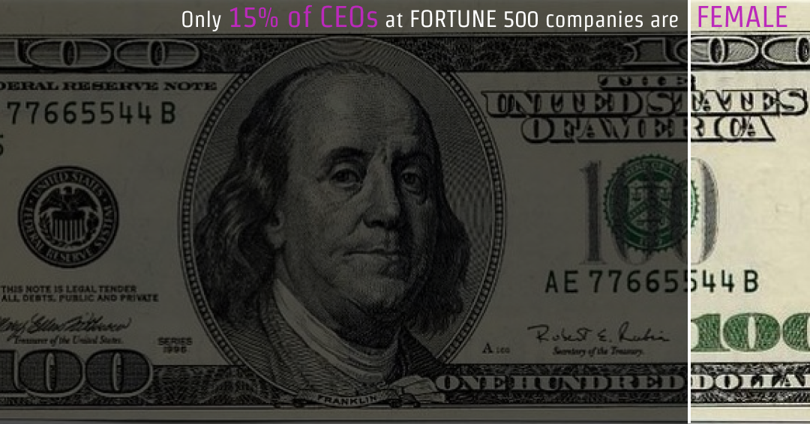
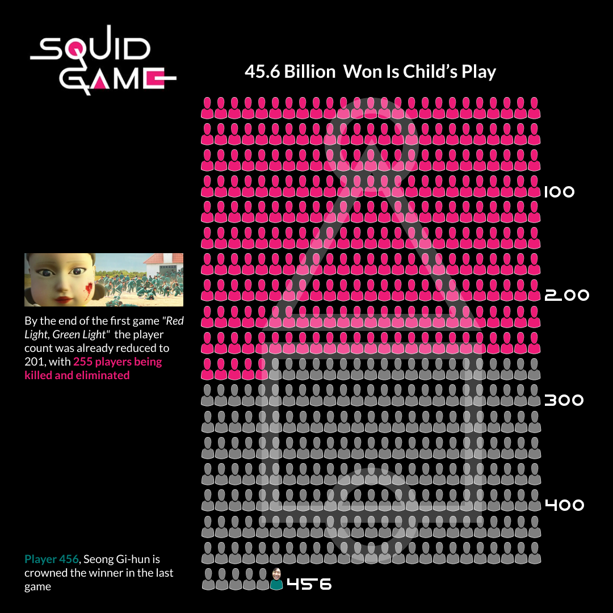
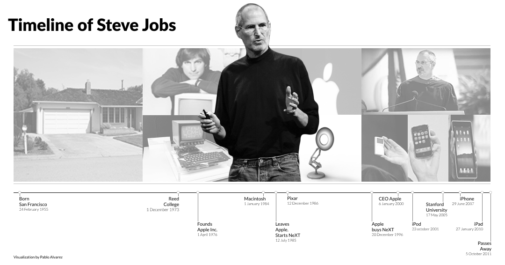
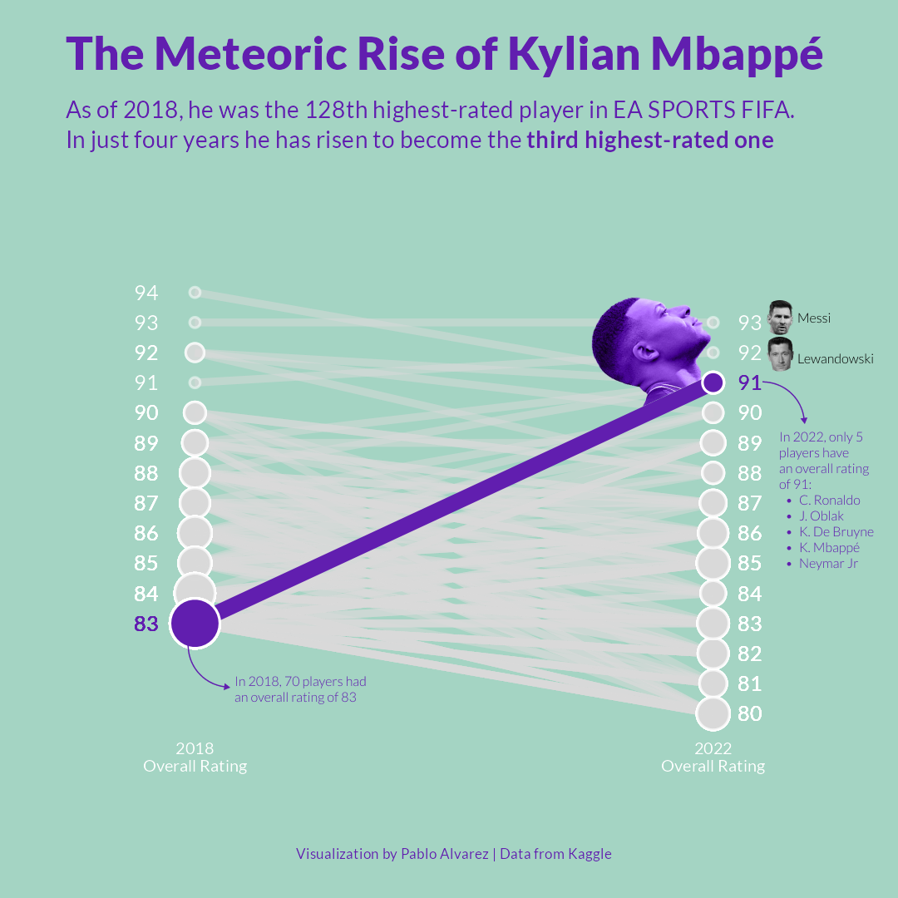
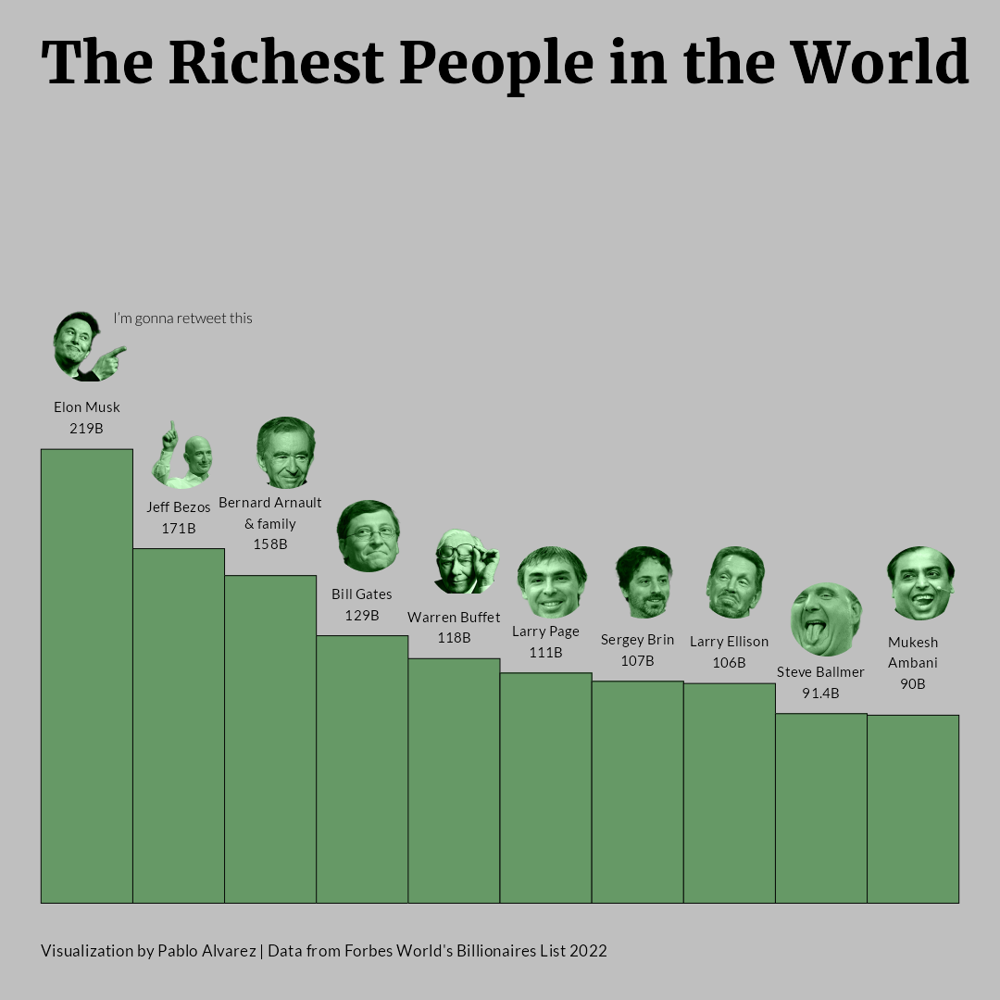
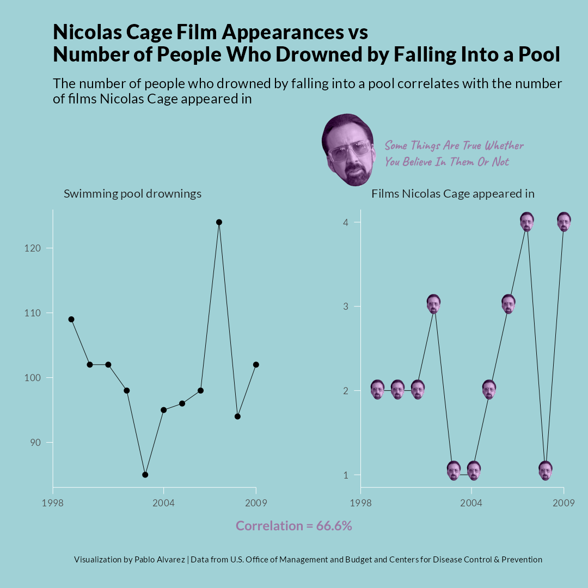
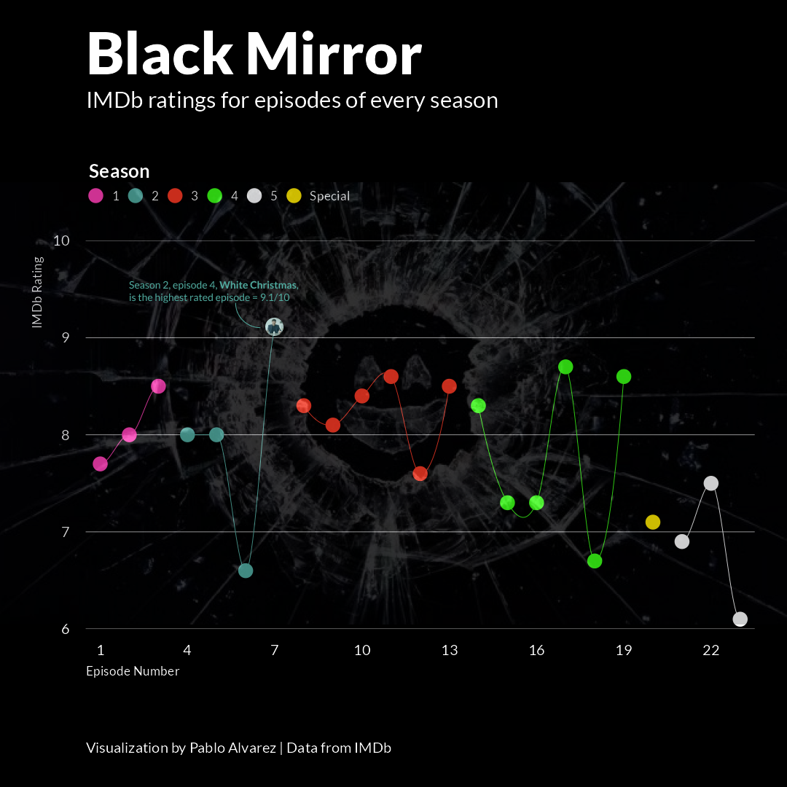
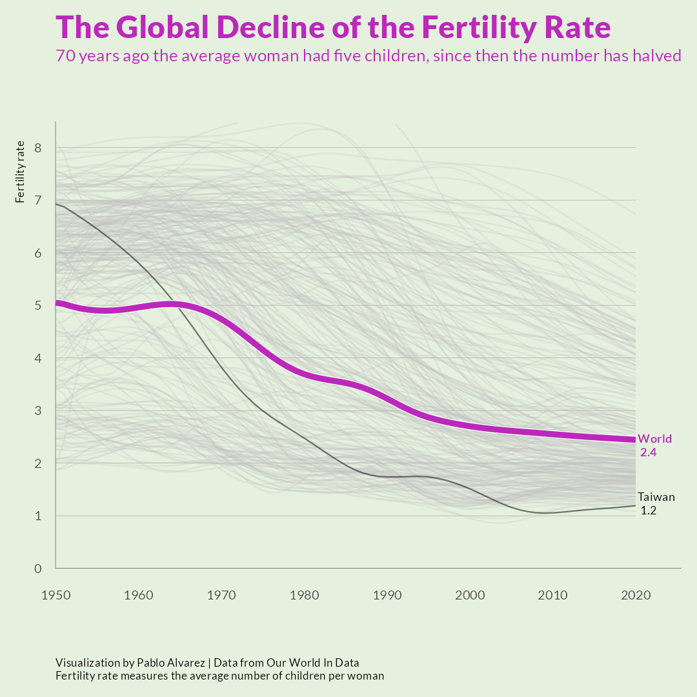
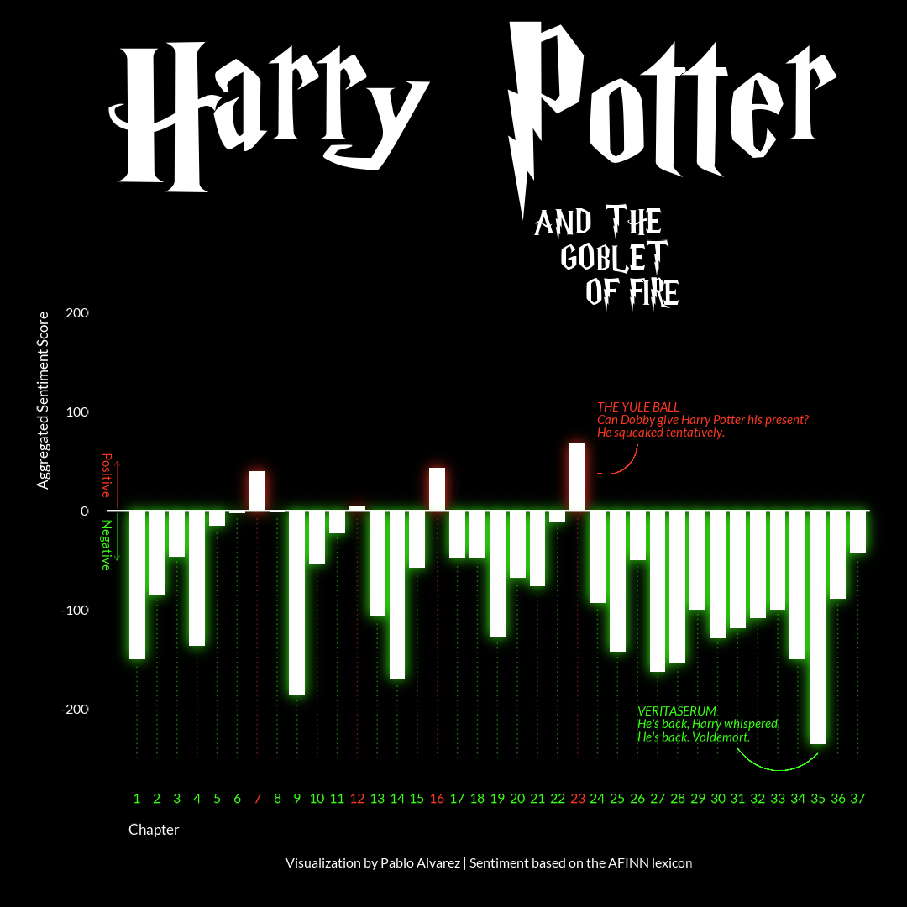
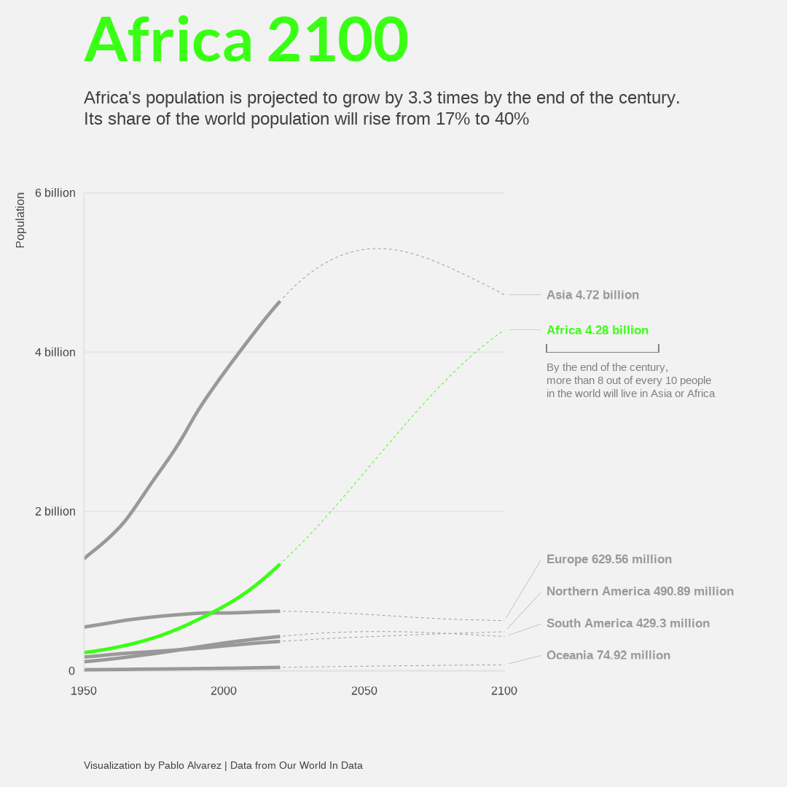

<h1 style="font-weight:normal" align="center">
  &nbsp;#30DayChartChallenge 2022&nbsp;
</h1>

     
      Let's connect!
      
      
&nbsp;&nbsp;&nbsp;
&nbsp;&nbsp;&nbsp; 
&nbsp;&nbsp;&nbsp;
&nbsp;&nbsp;&nbsp;
&nbsp;&nbsp;&nbsp;
 
 
 

My contributions to the <a href="https://twitter.com/30DayChartChall" target="_blank">#30DayChartChallenge 2022</a>

  
  

  
▶️ List of all contributions (click to expand)

  
  1. Comparisons
      * [Part-to-Whole](/01_part_to_whole)
      * [Pictogram](/02_pictogram)
      * [Historical](03_historical)
      * [Slope](/05_slope)
      * [Data Day:OWID](/06_data_day_OWID)
  2. Distributions
      * [Statistics](/09_statistics)
  3. Relationships
      * [Correlation](/09_correlations)
      * [Connections](/17_connections)
  4. Timeseries
      * [Global Change](19_global_change/30chartchallenge_19_global_change_2022.png)
      * [Down-upwards](21_down_upwards/30chartchallenge_21_down_upwards_2022.png)
  5. Uncertainties
      * [Future](27_future/30chartchallenge_27_future_2022.png)

### Comparisons
#### Day 1: [Part-to-Whole](/01_part_to_whole)

🛠 Tools: Figma

#### Day 2: [Pictogram](/02_pictogram)

🛠 Tools: Figma

#### Day 3: [Historical](/03_historical)

🛠 Tools: Figma + Photoshop

#### Day 5: [Slope](/05_slope)

🛠 Tools: R + Figma + Photoshop

#### Day 6: [Data Day:OWID](/06_data_day_OWID)

🛠 Tools: R + Figma

### Distributions
#### Day 9: [Statistics](/09_statistics)

🛠 Tools: R + Figma + Photoshop

### Relationships
#### Day 13: [Correlation](/13_correlation)

🛠 Tools: R + Figma + Photoshop

#### Day 17: [Connections](/17_connections)

🛠 Tools: R + Figma

### Timeseries
#### Day 19: [Global Change](/19_global_change)

🛠 Tools: R

#### Day 21: [Down/upwards](21_down_upwards)

🛠 Tools: R

### Uncertainties
#### Day 27: [Future](27_future)

🛠 Tools: R
